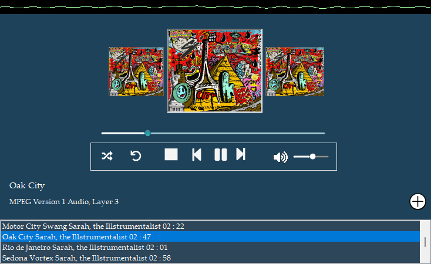

# Basic Music Player  🎵🎶

This is a simple music player application created using C# and Visual Studio Code. It allows you to play your favorite music files with ease.

## Features

- Play, pause, and control music playback.
- Adjust the volume to your liking.
- Easily navigate through your music library.
- Support for popular audio file formats.

## Getting Started

1. Clone this repository to your local machine.
